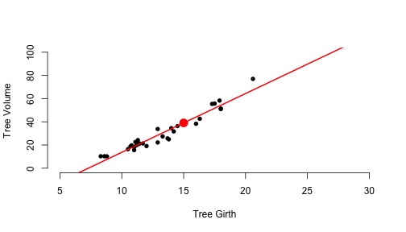

Coursera Developing Data Products - Course Project
========================================================
author: Anthony Iannolo
date: April 19 2019
autosize: true

Background
========================================================
<small>This Coursera course project has two major parts.  The first is to create a shiny application and deploy it to Rstudios shinyapps.io site.  The second part is to create this presentation pitch using R Studio Presenter.

- The application is hosted in shiny at the following link:
https://anthonyiannolo.shinyapps.io/shiny_linear_model/

- The shiny application ui and server code is located in guthub at the following link:
https://github.com/AnthonyIannolo/Coursera_Data_Products_Project


The following slides include a review of the datset used for the application and a detailed description of the shiny linear model application built by leveraging the trees dataset.</small>


Data Used for Modeling - R Trees Dataset
========================================================

<small>The trees dataset has 31 observations of three numeric variables for black cherry trees.  The variables include Girth (in), Height (ft) and Volume (ft**3).

Below are furhter details regarding the trees dataset variables.</small>


```r
 summary(trees)
```

```
     Girth           Height       Volume     
 Min.   : 8.30   Min.   :63   Min.   :10.20  
 1st Qu.:11.05   1st Qu.:72   1st Qu.:19.40  
 Median :12.90   Median :76   Median :24.20  
 Mean   :13.25   Mean   :76   Mean   :30.17  
 3rd Qu.:15.25   3rd Qu.:80   3rd Qu.:37.30  
 Max.   :20.60   Max.   :87   Max.   :77.00  
```


Shiny Web Application
========================================================
<small>This shiny application creates two linear models to estimate tree volume.  The application includes a User (ui.R) and a Server component (server.R).

The user component provides two sliders for input to estimate tree volume.  The first slider requests tree Girth and Model-1 tab will show the volume estimate based on tree Girth. The second slider requests tree height and Model-2 tab will show the tree volume estimate based on tree height.

The server code below is used for Model 1 which has volume as the outcome with Girth as the predictor.  The user input for the model predictor of Girth is evaluated to provide the volume estimate.</small>

```r
    model1 <- lm(Volume ~ Girth, data = trees)
    model1pred <- {GirthInput <- 15
    predict(model1, newdata = data.frame(Girth = GirthInput))}
```
Shiny Application Model-1 Tab
========================================================
<small>The Plot shows data points used in the model with the regression line and predicted value of tree volume based on the user slider input of tree girth (default input =15).</small>





```
[1] "Predicted Tree Volume from Girth:  39.044"
```
